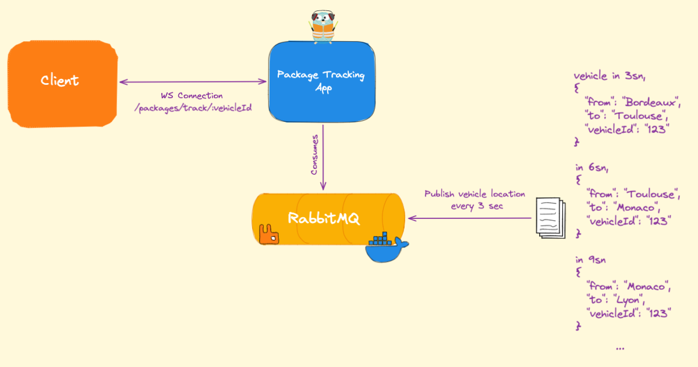
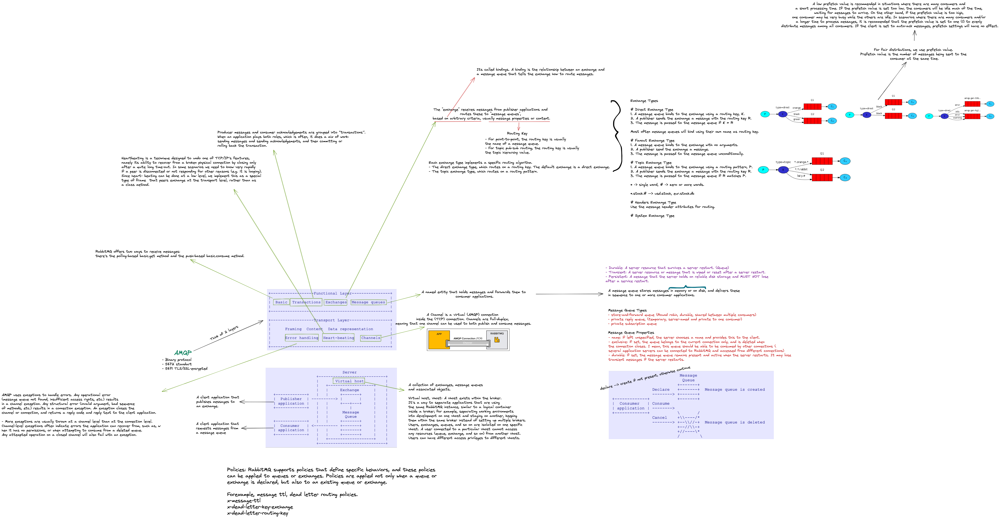

# Overall Architecture

[For details check my blog post](https://abdulsamet-ileri.medium.com/lets-implement-a-real-time-package-tracking-app-with-rabbitmq-and-web-socket-using-go-80f5a5ca5c55)

# My rabbitmq Notes

